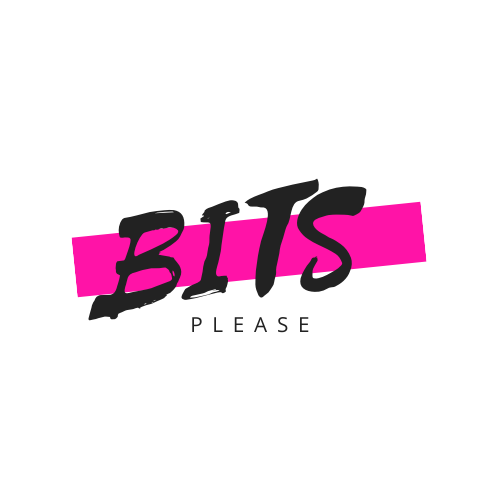

<h1 align="center"> BITS PLEASE </h1>

  

<h3 align="center">
  BITS PLEASE submission for Valeo IET Hackathon
</h3>

---

**Submission for problem statement-2:**
 
* [Documentation](https://github.com/akss13/IET-Hackathon/blob/master/BIT_Turner_doc/bitturner.md)

**Submission for problem statement-4:**

* [Documentation](https://github.com/akss13/IET-Hackathon/blob/master/Slothman_doc/doc_ps-4.md)

