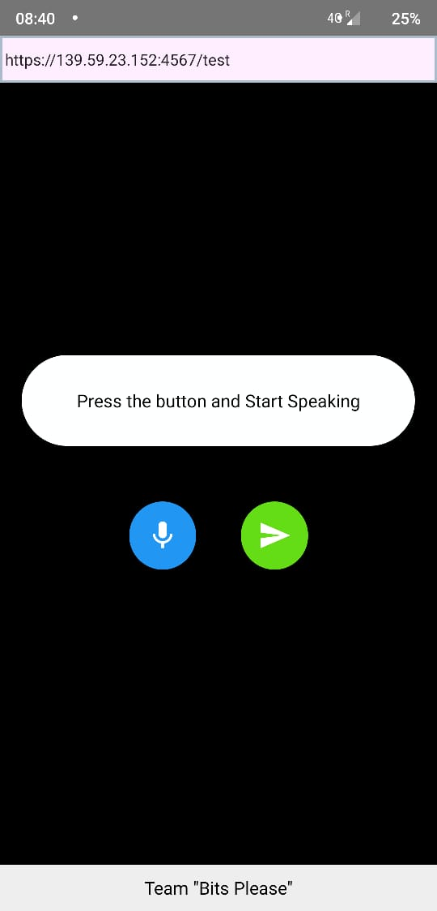
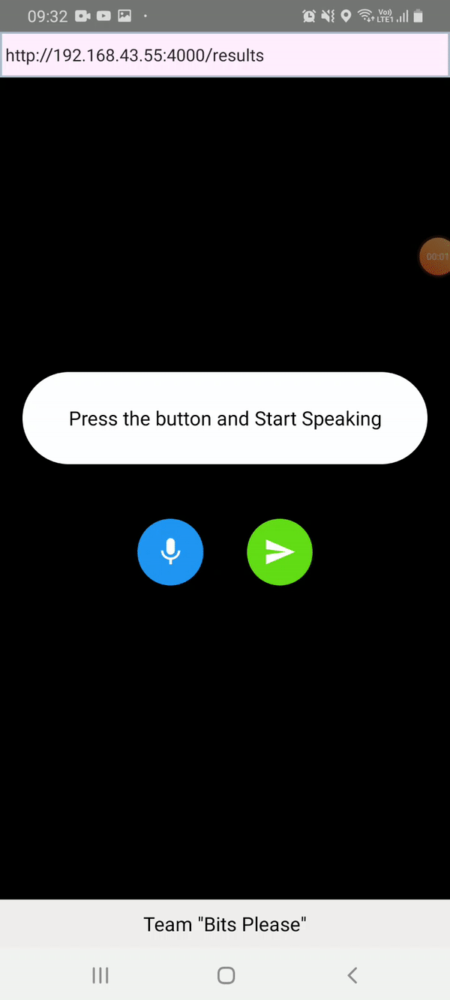

<h1 align="center"> Slothman </h1>  

  

  Voice assistant built using google API.

## Table of Contents

- [Introduction](#introduction)
- [Features](#features)

## Introduction

Slothman is inhouse developed voice assistant built over google voice assistant to enable voice commands in your project. Slothman can be built to have custom commands of your choice.

Slothman is built on react native which makes it easily portable to multiple platforms with little modifications.
 

**__Available for Android and iOS__**

  

## Features

Few tasks that can be performed with Slothman are:

* Create custom voice commands
* Have dictonary of given voice commands
* Give numeric values as input
* Link any application with Slothman to have voice commands
* Robust voice recognition
* Support for multiple languages
* Parse voice commands to english for easy use

## Demonstration and working of Slothman

 

## Usage and installation instructions
* Install the provided apk
* Provide the IP address of your server and the listening port 
* GIve permissions to the app to use mic and speaker
* Tap mic button to input voice commands
* Tap send button to send commands to the listening server
